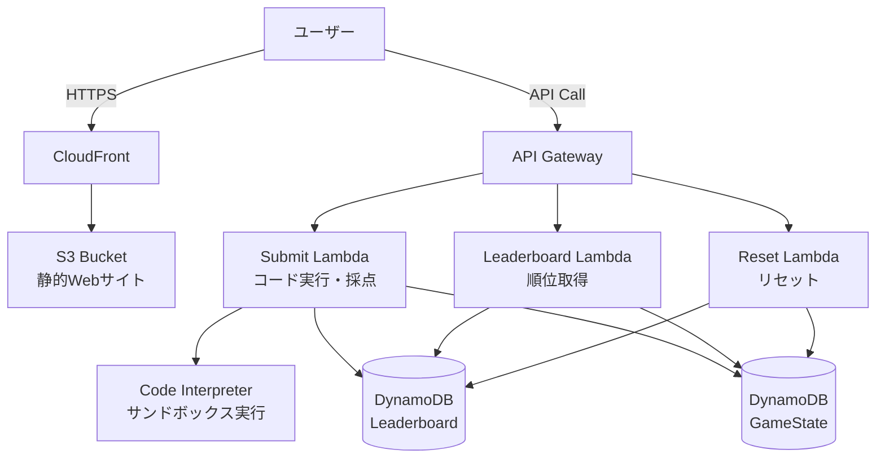
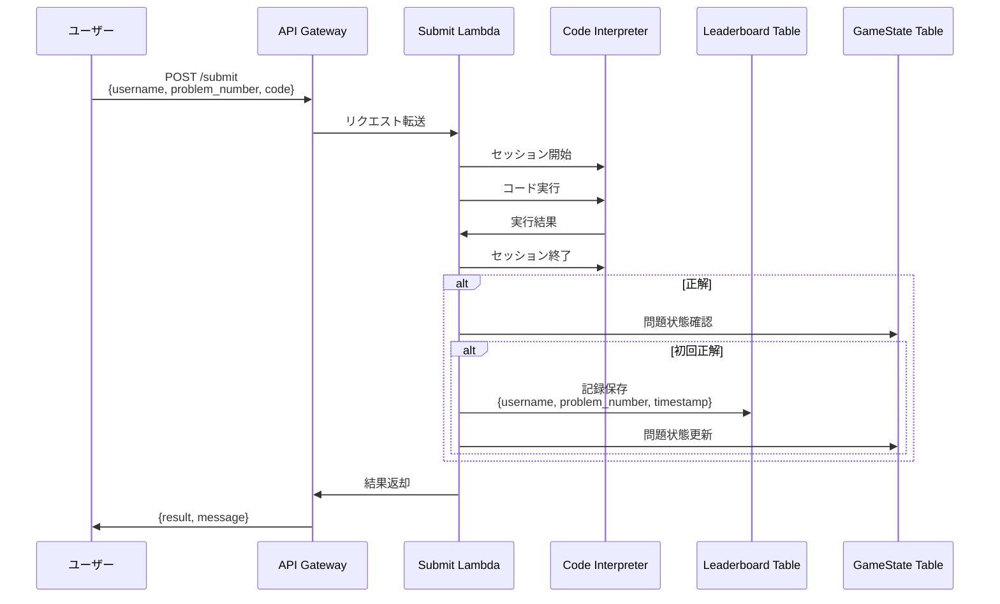
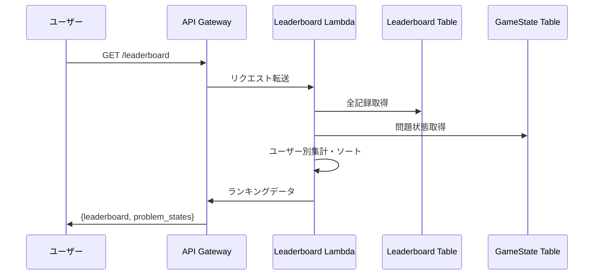

# Code Interpreter Coding Contest

Code Interpreter Coding Contestは、様々な問題をコーディングコンテスト・タイムアタック形式で競い合うためのサーバーレスプラットフォームです。

Amazon Bedrock AgentCore Code Interpreterを活用したサンドボックスでの安全なコード実行環境、リアルタイムリーダーボード、RESTful APIを提供し、AI駆動のコーディングコンテストを簡単に開催できます。

## 主な機能

- **安全なコード実行**: Amazon Bedrock AgentCore Code Interpreterによるサンドボックス環境でのPythonコード実行
- **リアルタイムリーダーボード**: CloudFront + S3でホストされる自動更新型のWebインターフェース
- **RESTful API**: コード提出、順位取得、ゲーム状態管理のためのAPI Gateway統合
- **カスタマイズ可能な問題セット**: JSON形式で簡単に問題を追加・編集可能
- **Basic認証**: 管理画面へのアクセス制御

## デプロイ

```bash
pip3 install -r requirements.txt
cdk bootstrap  # 初回のみ
cdk deploy --parameters AdminUsername=<ユーザー名> --parameters AdminPassword=<セキュアなパスワード>
```

## 使用方法

詳細はRUNBOOK.mdをご参照ください。

## アーキテクチャ



## データフロー

### コード提出フロー


### リーダーボード取得フロー


## Security

See [CONTRIBUTING](CONTRIBUTING.md#security-issue-notifications) for more information.

## License

This library is licensed under the MIT-0 License. See the LICENSE file.

